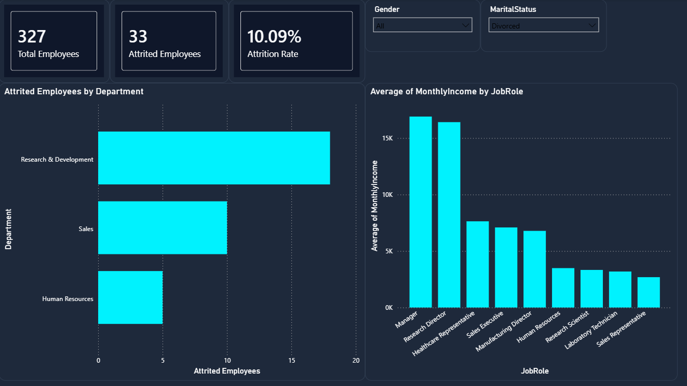

# HR Workforce Analytics & Employee Attrition Dashboard

## 📊 Project Overview
An interactive, executive-level business intelligence dashboard designed to analyze corporate workforce retention patterns. This project focuses on isolating the core demographic and financial drivers behind employee turnover, enabling human resource teams to make data-driven decisions to mitigate attrition risks.

## 📷 Dashboard Preview

## 📂 Repository File Structure
* **`dashborad_Hr.pbix`**: The complete, production-ready Power BI file containing data transformations, analytical metrics, and custom visual layers.
* **`HR_preview.png`**: A high-resolution image showcasing the dynamic neon-cyber dark mode user interface.

## 🛠️ Tech Stack & Skills
* **BI Platform:** Power BI Desktop
* **Modeling & Architecture:** DAX (Data Analysis Expressions), Custom JSON UI Theme Design
* **Data Ingestion:** Power Query (Schema typing, data hygiene)
* **Core Competencies:** Interactive dashboard design, diagnostic analytics, KPI tracking, workforce segmentation

## 📊 Implemented Analytical Features
* **Executive KPI Strip:** Provides high-level visibility into core operational metrics including Total Headcount, Terminated Employee volume, and the overall calculated Attrition Rate ($16.12\%$).
* **Departmental Concentration Analysis:** A custom horizontal bar visual that tracks absolute attrition volumes across corporate segments (Research & Development, Sales, and Human Resources).
* **Compensation & Seniority Mapping:** A vertical clustered column chart cross-referencing average monthly income levels with structural job roles to expose retention vulnerabilities in lower-tier brackets.
* **Dynamic Demographic Slicers:** Fully interactive filtering controls mapped to Employee Gender and Marital Status that refresh all database metrics dynamically upon selection.

## 💡 Strategic Insights Discovered
* **Volumetric Hotspots:** Research & Development exhibits the highest absolute volume of attrited personnel, requiring targeted operational wellness strategies.
* **Financial Elasticity:** A clear negative correlation exists between compensation tiers and turnover velocity; roles yielding lower average monthly income (e.g., Sales Representatives, Laboratory Technicians) face significantly elevated churn rates compared to executive paths.
